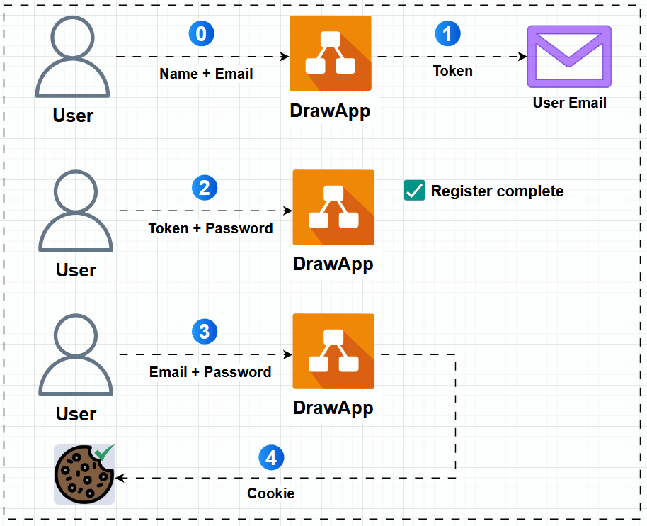
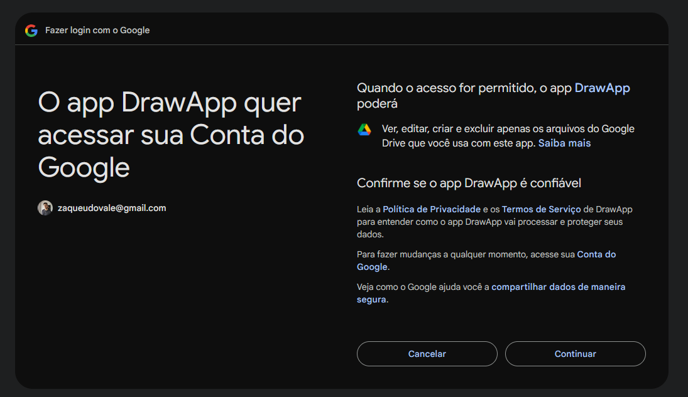
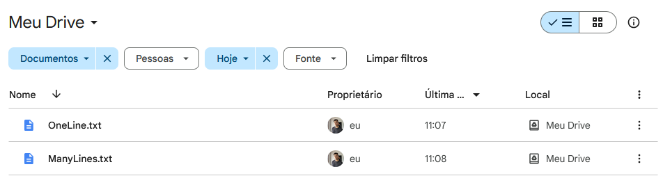
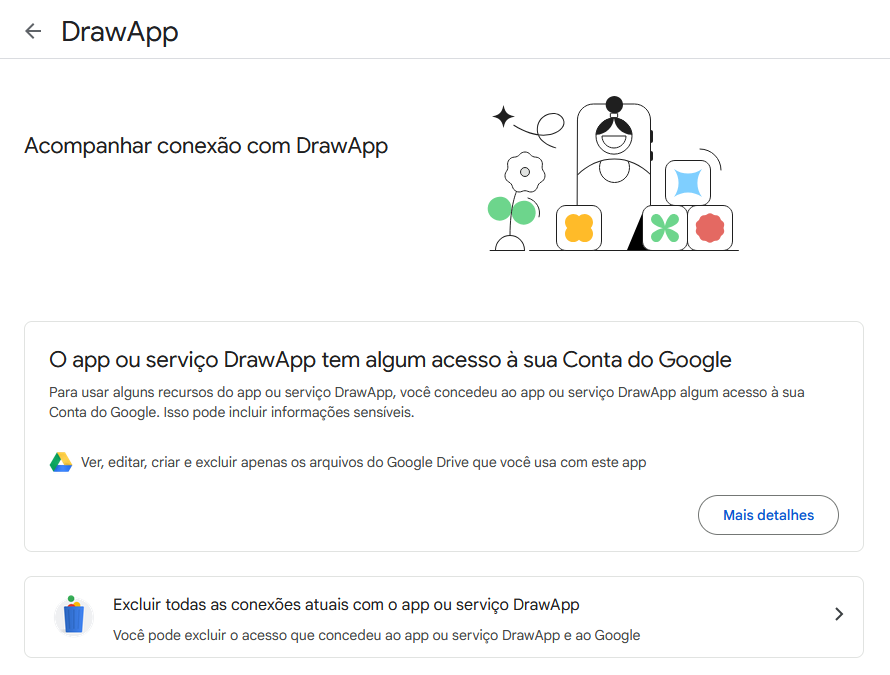
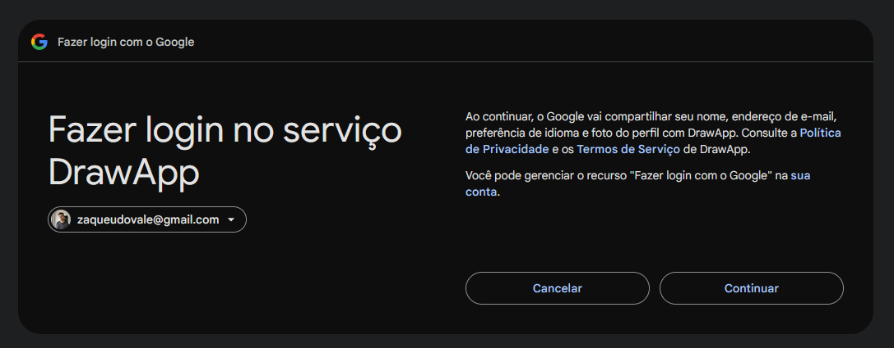

# OAuth 2.0 + OpenID Connect (OIDC)

O objetivo desse projeto é mostrar na prática o uso dos protocolos OAuth 2.0 e OpenID Connect.

Para facilitar o entendimento, vamos supor que você quer usar uma aplicação web para desenhar diagramas, como o Draw.io.

No primeiro cenário, você vai se cadastrar na aplicação, informar nome e email, confirmar seu email, definir sua senha e enfim logar no sistema.
O Draw.io possui integração com o Google Drive, o que permite que você salve seus diagramas na nuvem e os acesse de qualquer lugar.
Mas como você pode habilitar essa funcionalidade de maneira simples e segura?
Como garantir que o Draw.io vai poder acessar apenas os arquivos que você **autorizar**?
Resposta: usando o OAuth 2.0!

No segundo cenário, suponha que você não quer passar por todo o fluxo de se cadastrar no sistema, confirmar seu email, definir senha e só então logar no app.
Afinal, você já está logado na sua conta Google, poderia muito bem usar ela para se **autenticar** no Draw.io.
Mas novamente, como isso pode ser feito, de maneira simples e segura?
Resposta: usando o OpenID Connect!

## Sumário
- 1️⃣ Simulando o Draw.io
- 2️⃣ Setup Inicial
- 3️⃣ Autorização com OAuth 2.0
- 4️⃣ Autenticação com OpenID Connect (OIDC)
- 5️⃣ Referências

Adicionei um docker-compose.yml ao projeto, caso você queira rodá-lo na sua máquina também.

## 1️⃣ Simulando o Draw.io

Para ver na prática como esses protocolos funcionam, criei uma API em .NET bem simples, que vai simular a aplicação do Draw.io nos dois cenários descritos anteriormente.
Vou me referir a essa API como DrawApp de agora em diante.

Ela possui os seguintes endpoints:
- POST /users
    - Cria um usuário, informando nome, email e senha
- POST /login
    - Realiza o login no sistema, informando email e senha
    - A autenticação é feita via Cookie

- GET /users/data
    - Retorna alguns dados do usuário logado: nome, email e se a integração com o Google Drive está ativada

- GET /oauth/google-drive
    - Redireciona o usuário logado para a tela de consenso do Google
    - Nela o usuário pode autorizar que o DrawApp salve dados no seu Google Drive
- POST /google-drive/files
    - Permite a criação de arquivos no Google Drive do usuário, caso ele tenha autorizado o acesso usando o endpoint anterior

- GET /login/google
    - Redireciona o usuário deslogado para a tela de consenso do Google
    - Nela o usuário pode autorizar que o DrawApp tenha acesso ao seu nome e email
    - Se o usuário permitir, a API automaticamente realiza seu cadastro e o loga no sistema

<p align="center">
  
</p>

Estou usando o Postgres para salvar todos os dados do DrawApp.

## 2️⃣ Setup Inicial

Antes de mais nada, é razoável pensar que o DrawApp precise estar previamente configurado no Google para que tudo isso funcione.
Afinal, quando o usuário é redirecionado pra tela de consenso, o Google já conhece o DrawApp e sabe quais permissões ele deseja obter do usuário.

Seguem os principais passos para realizar esse setup inicial:
- Criar projeto no Google Cloud e configurar seu nome como DrawApp
- Habilitar o acesso do DrawApp à API do Google Drive
- Adicionar meu email como usuário de teste

- Adicionar escopo de acesso ao Google Drive que o DrawApp vai pedir pro usuário no fluxo de autorização (OAuth 2.0)
    - Vamos usar o escopo "drive.file", que permite **apenas** a criação/edição de arquivos que o usuário utilizou no DrawApp

- Adicionar escopos para que o DrawApp tenha acesso aos dados necessários para realizar o login via conta Google (OIDC)
    - Aqui vamos usar os escopos "openid" e "userinfo.email"
    - Eles juntos retornam dados pessoais do usuário, como nome e email
- Dentro do projeto, criar nossas credenciais:
    - URI de origem            -> http://localhost:5001
    - URI de callback do OAuth -> http://localhost:5001/oauth/drawapp-callback
    - URI de callback do OIDC  -> http://localhost:5001/oidc/drawapp-callback
    - ClientId                 -> Identifica o DrawApp dentro do Authorization Server
    - ClientSecret             -> Autentica o DrawApp dentro do Authorization Server

## 3️⃣ Autorização com OAuth 2.0

Vamos voltar pro primeiro cenário apresentado lá no começo:

Você vai se cadastrar no DrawApp, informar nome e email, confirmar seu email, definir sua senha e enfim logar no sistema.
O DrawApp possui integração com o Google Drive, o que permite que você salve seus diagramas na nuvem e os acesse de qualquer lugar.
Mas como você pode habilitar essa funcionalidade de maneira simples e segura?
Como garantir que o DrawApp vai poder acessar apenas os arquivos que você **autorizar**?
E indo além, como posso revogar o acesso do DrawApp ao meu Google Drive?

Como você já sabe, podemos atingir esses objetivos usando o OAuth, pois ele é um protocolo de autorização criado justamente para problemas desse tipo (Delegated Authorization).

### Vamos definir alguns termos antes:

- Resource Owner
    - O usuário, que usa o DrawApp e é dono da conta no Google Drive
- Client
    - DrawApp, a aplicação que está pedindo permissão ao usuário para acessar seus arquivos no Google Drive
- Resource Server
    - Google Drive, onde estão os recursos (arquivos) do usuário
- Authorization Server
    - Servidor do Google que intermedia todos os fluxos
    - Ele é o responsável pela emissão de códigos e tokens de acesso

- Scopes
    - São as permissões que o DrawApp quer receber do usuário (mostradas na tela de consentimento do Authorization Server)
- Redirect URI
    - Callback URI (http://localhost:5001/oauth/drawapp-callback)
    - O Authorization Server redireciona o usuário pra essa URI quando ele permite que o DrawApp tenha acesso ao Google Drive
- Authorization Code
    - Esse código é a prova que o usuário clicou em "Permitir acesso" na tela de consentimento
- Access Token
    - O DrawApp utiliza o Authorization Code, juntamente com seu ClientId e ClientSecret, para obter esse token no Authorization Server
    - O token obtido permite que o DrawApp tenha acesso ao Google Drive do usuário
- State
    - Valor aleatório gerado pelo Client e validado depois na chamada de callback (ajuda a mitigar ataques de Cross-Site Request Forgery)

### Segue o fluxo de registro e login no sistema

- 0️⃣ Usuário informa nome + email ao DrawApp
- 1️⃣ Sistema gera token para definição de senha e o envia pra email informado
- 2️⃣ Usuário envia token + senha pro DrawApp, completando seu registro no app
- 3️⃣ Usuário agora informa email + senha pra logar no app
- 4️⃣ DrawApp gera um Cookie de autenticação e retorna ele pro navegador do usuário

<p align="center">
  
</p>

### Uma vez logado, agora o usuário pode habilitar a integração com o Google Drive

- 0️⃣ Usuário acessa o endpoint GET /oauth/google-drive para permitir que o DrawApp possa salvar arquivos na sua conta do Google Drive
- 1️⃣ Ao acessar esse endpoint, o DrawApp monta a seguinte url e redireciona o usuário pro Authorization Server através dela

```
https://accounts.google.com/o/oauth2/v2/auth?
client_id=11118065658&
scope=https://www.googleapis.com/auth/drive.file&
redirect_uri=http://localhost:5001/oauth/drawapp-callback&
response_type=code&
state=qHtkl100DwyOWVLVmctDOW47
```

Significado de cada parâmetro:

    - client_id: identificador do DrawApp lá no Google (obtido no Setup Inicial)
    - scope: escopo que o DrawApp quer ter acesso
    - redirect_uri: pra onde o Authorization Server deve redirecionar o usuário quando ele permitir o acesso
    - response_type: qual tipo de resposta o DrawApp espera receber do Authorization Server (no caso, ele espera receber um Authorization Code)
    - state: valor aleatório gerado pelo Client e validado depois na chamada de callback (ajuda a mitigar ataques de Cross-Site Request Forgery)

- 2️⃣ Agora na página de consentimento do Authorization Server, o usuário pode ver quais escopos o DrawApp quer acessar. Ao clicar em "Continuar", o Authorization Server irá gerar um Authorization Code e enviá-lo pro DrawApp ao redirecionar o usuário pra Callback URI definida no setup inicial

<p align="center">
  
</p>

A URL de callback é a seguinte:

```
http://localhost:5001/oauth/drawapp-callback?
state=qHtkl100DwyOWVLVmctDOW47&
code=4/0ASVgi3LdgvHEjS-wQtZpra6C9xRH0nTwGhQrP8xb4fjrRxnHe_s0fFc2SBEj7ZTrjgYurA
```

Significado de cada parâmetro:

    - state: mesmo valor explicado anteriormente
    - code: Authorization Code, a prova de que o usuário permitiu que o DrawApp tivesse acesso ao escopo drive.file do seu Google Drive

- 3️⃣ Internamente, o DrawApp utiliza o Authorization Code (juntamente com ClientId + ClientSecret) para realizar uma chamada pra API do Authorization Server (https://oauth2.googleapis.com/token), que valida todas as informações e retorna um Access Token pro DrawApp. Esse token é então salvo no banco de dados e toda vez que o usuário quiser salvar um diagrama no seu Google Drive, basta que o DrawApp utilize-o nas chamadas de API. Para provar que tudo funciona, chamei o endpoint POST /google-drive/files para criar arquivos no Google Drive via DrawApp. Segue o print dos arquivos criados:

<p align="center">
  
</p>

- 4️⃣ Se o usuário não quiser mais permitir o acesso do DrawApp ao seu Google Drive, basta acessar sua conta Google e revogar as permissões dadas anteriormente.

<p align="center">
  
</p>

## 4️⃣ Autenticação com OpenID Connect (OIDC)

Vamos voltar pro segundo cenário apresentado lá no começo:

Suponha que você não quer passar por todo o fluxo de se cadastrar no sistema, confirmar seu email, definir senha e só então logar no app.
Afinal, você já está logado na sua conta Google, poderia muito bem usar ela para se **autenticar** no DrawApp.
Mas novamente, como isso pode ser feito, de maneira simples e segura?

Como acabamos de ver, o OAuth é desenhado para resolver problemas de autorização. No entanto, com algumas modificações, daria pra extendê-lo e usá-lo como um protocolo de autenticação. Assim nasce o protocolo OpenID Connect!

Perceba que o OAuth não entrega pro DrawApp nenhuma informação pessoal do usuário, como nome ou email, que poderiam ser usadas para autenticá-lo. O OIDC surge como uma camada acima do OAuth, definindo um padrão para que esses dados sobre o usuário cheguem até o Client.

Dessa forma, o OIDC possibilita que o usuário utilize sua conta Google para se cadastrar e logar no DrawApp de maneira automática, apenas com alguns cliques.

### OpenID Connect passo a passo

O fluxo do OIDC é praticamente o mesmo do OAuth, só que o DrawApp recebe um ID Token quando o usuário clica em "Continuar". Esse token é um JWT que contém diversas informações pessoais do usuário, como nome e email. Com esses dados, o DrawApp consegue cadastrar e logar o usuário automaticamente.

- 0️⃣ Usuário acessa o endpoint GET /login/google para realizar login no DrawApp usando sua conta Google
- 1️⃣ Ao acessar esse endpoint, o DrawApp monta a seguinte url e redireciona o usuário pro Authorization Server através dela

```
https://accounts.google.com/o/oauth2/v2/auth?
client_id=11118065658&
scope=openid profile https://www.googleapis.com/auth/userinfo.email&
redirect_uri=http://localhost:5001/oidc/drawapp-callback&
response_type=code id_token&
state=zMivNStaPUItbPvLrwx7fx2Jw9M8JW23i1
```

Significado de cada parâmetro:

    - client_id: identificador do DrawApp lá no Google (obtido no Setup Inicial)
    - scope: escopos que o DrawApp quer ter acesso
    - redirect_uri: pra onde o Authorization Server deve redirecionar o usuário quando ele permitir o acesso
    - response_type: qual tipo de resposta o DrawApp espera receber do Authorization Server (no caso, ele espera receber um Authorization Code + um ID Token)
    - state: valor aleatório gerado pelo Client e validado depois na chamada de callback (ajuda a mitigar ataques de Cross-Site Request Forgery)

- 2️⃣ Agora na página de consentimento do Authorization Server, o usuário pode ver quais escopos o DrawApp quer acessar. Ao clicar em "Continuar", o Authorization Server irá gerar um Authorization Code + ID Token e enviá-los pro DrawApp ao redirecionar o usuário pra Callback URI definida no setup inicial

<p align="center">
  
</p>

- 3️⃣ Internamente, o DrawApp utiliza os dados contidos no ID Token para registrar o usuário no sistema e já realizar o login, retornando um Cookie de autenticação pro navegador.


## 5️⃣ Referências

- OAuth 2.0 and OpenID Connect (in plain English) (https://youtu.be/996OiexHze0)
- An Illustrated Guide to OAuth and OpenID Connect (https://youtu.be/t18YB3xDfXI)
- ASP.NET Core OAuth Authorization (.NET 7 Minimal Apis C#) (https://youtu.be/0uSwPdYOm9k)
- An introduction to OpenID Connect in ASP.NET Core (https://andrewlock.net/an-introduction-to-openid-connect-in-asp-net-core)
- How to secure ASP.NET Core with OAuth and JSON Web Tokens (https://blog.elmah.io/how-to-secure-asp-net-core-with-oauth-and-json-web-tokens/)
